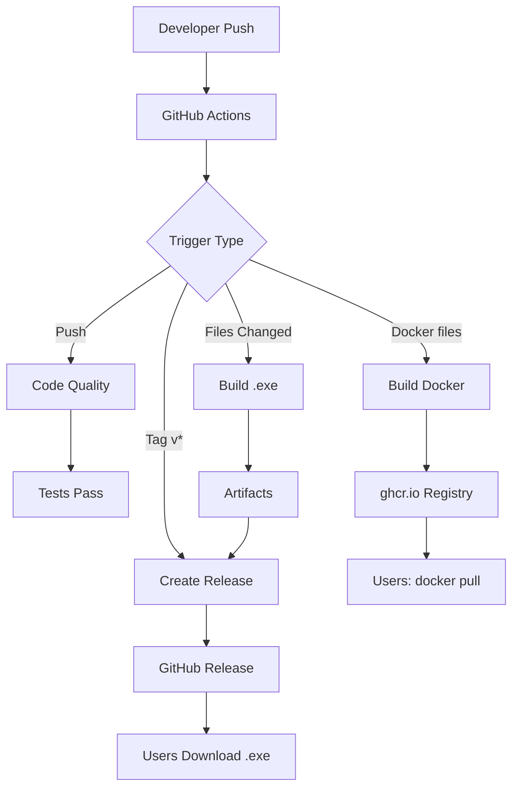

# Deployment Guide

Полное руководство по развертыванию и использованию проектов Rutina.

---

## 📦 Для Пользователей

### Скачивание готовых .exe файлов

**Самый простой способ!**

1. Перейдите на [GitHub Releases](https://github.com/RomanAndAndrey/Scripts/releases)
2. Выберите последнюю версию (Latest)
3. Скачайте нужный .exe файл:
   - `DesktopLauncher-v{version}-windows.exe` - Главное приложение
   - `FileOrganizer-v{version}-windows.exe` - Сортировка файлов
   - `Anti-AltTab-v{version}-windows.exe` - Блокировка Alt+Tab
   - `DotaCoach-v{version}-windows.exe` - Dota 2 оверлей

4. Запустите скачанный файл - готово! ✅

**Примечание:** Windows может показать предупреждение SmartScreen - нажмите "More info" → "Run anyway"

### Проверка целостности

Каждый .exe файл имеет SHA256 checksum для проверки:

```bash
certutil -hashfile DesktopLauncher-v1.0.0-windows.exe SHA256
# Сравните с файлом .sha256
```

### Автоматические обновления

DesktopLauncher поддерживает автообновления:
- Проверка при запуске (через 2 секунды)
- Ручная проверка: меню "🔄 Check for Updates"
- Автоматическая загрузка и установка

---

## 🐳 Docker Deployment

### FileOrganizer

**Быстрый запуск:**

```bash
# Docker Compose (рекомендуется)
docker-compose up -d file-organizer

# Или напрямую
docker pull ghcr.io/romanandandrey/rutina-file-organizer:latest
docker run -d \
  --name rutina-file-organizer \
  -v ~/Downloads:/downloads \
  ghcr.io/romanandandrey/rutina-file-organizer:latest
```

**Настройка через environment variables:**

```yaml
environment:
  - DOWNLOADS_PATH=/downloads
  - LOG_LEVEL=INFO
```

**Логи:**

```bash
docker logs rutina-file-organizer -f
```

---

## 👨‍💻 Для Разработчиков

### Локальная разработка

**1. Клонирование репозитория:**

```bash
git clone https://github.com/RomanAndAndrey/Scripts.git
cd Scripts
```

**2. Установка зависимостей:**

```bash
# Для всех проектов
pip install -r requirements.txt

# Только для разработки
pip install black isort mypy pylint pytest pytest-cov pre-commit
```

**3. Настройка pre-commit:**

```bash
pre-commit install
```

Теперь код будет автоматически форматироваться перед каждым коммитом!

**4. Запуск проектов:**

```bash
# DesktopLauncher
python DesktopLauncher/main.py

# FileOrganizer
python FileOrganizer/organizer.py

# И т.д.
```

### Компиляция в .exe

**DesktopLauncher:**

```bash
cd DesktopLauncher
pyinstaller DesktopLauncher.spec

# Результат: dist/DesktopLauncher.exe
```

**FileOrganizer:**

```bash
cd FileOrganizer
pyinstaller FileOrganizer.spec

# Результат: dist/FileOrganizer.exe
```

**Updater:**

```bash
cd scripts
pyinstaller updater.spec

# Результат: dist/updater.exe
```

### Тестирование

**Запуск всех тестов:**

```bash
pytest tests/ -v
```

**С покрытием кода:**

```bash
pytest tests/ -v --cov=. --cov-report=html
# Откройте htmlcov/index.html
```

**Только common библиотека:**

```bash
pytest tests/test_common/ -v
```

### Code Quality

**Форматирование:**

```bash
black .
isort .
```

**Проверка типов:**

```bash
mypy . --ignore-missing-imports
```

**Линтинг:**

```bash
pylint **/*.py --rcfile=pyproject.toml
```

---

## 🚀 CI/CD Pipeline

### GitHub Actions Workflows

Проект использует 6 автоматических workflows:

#### 1. Code Quality (`python-quality.yml`)

Запускается при: push, pull request

Проверки:
- Black форматирование
- isort сортировка импортов
- Mypy проверка типов
- Pylint анализ кода
- Pytest тесты

#### 2. Build DesktopLauncher (`build-desktop-launcher.yml`)

Триггеры:
- Push к master (если изменились `DesktopLauncher/**` или `common/**`)
- Создание тега `v*`
- Manual dispatch

Результат:
- `DesktopLauncher-v{VERSION}-windows.exe`
- SHA256 checksum
- Upload artifacts (30 дней)

#### 3. Build FileOrganizer (`build-file-organizer.yml`)

Аналогично DesktopLauncher

Результат:
- `FileOrganizer-v{VERSION}-windows.exe`

#### 4. Build Anti-AltTab (`build-anti-alttab.yml`)

Результат:
- `Anti-AltTab-v{VERSION}-windows.exe`

#### 5. Build DotaCoach (`build-dota-coach.yml`)

Результат:
- `DotaCoach-v{VERSION}-windows.exe`

#### 6. Docker Build (`build-docker.yml`)

Триггеры:
- Изменения в `.docker/**` или `docker-compose.yml`

Результат:
- Образ на `ghcr.io/romanandandrey/rutina-file-organizer`
- Tagged с версией и latest

#### 7. Create Release (`create-release.yml`)

Триггер: создание тега `v*`

Автоматически:
1. Собирает все .exe файлы
2. Генерирует changelog
3. Создает GitHub Release
4. Прикрепляет все artifacts

---

## 📝 Создание Нового Релиза

### Процесс релиза

**1. Обновите код и протестируйте:**

```bash
# Все тесты должны проходить
pytest tests/ -v

# Code quality
black . && isort .
```

**2. Обновите версию:**

```bash
python scripts/bump_version.py minor
# или: python scripts/bump_version.py major
# или: python scripts/bump_version.py patch
```

**3. Обновите CHANGELOG:**

```bash
python scripts/generate_changelog.py --latest
```

**4. Закоммитьте изменения:**

```bash
git add VERSION CHANGELOG.md
git commit -m "chore: bump version to X.Y.Z"
git push origin master
```

**5. Создайте тег:**

```bash
git tag -a v1.1.0 -m "Release 1.1.0: Description"
git push origin v1.1.0
```

**6. GitHub автоматически:**
- Скомпилирует все .exe
- Соберет Docker образы
- Создаст Release
- Опубликует файлы

**7. Проверьте релиз:**
- Перейдите на [Releases](https://github.com/RomanAndAndrey/Scripts/releases)
- Убедитесь что все файлы прикреплены
- Протестируйте скачанные .exe

---

## 🔧 Troubleshooting

### .exe не запускается

**Проблема:** Windows SmartScreen блокирует

**Решение:**
1. Нажмите "More info"
2. Нажмите "Run anyway"

**Проблема:** Отсутствуют зависимости (vcredist)

**Решение:**
Установите [Visual C++ Redistributable](https://aka.ms/vs/17/release/vc_redist.x64.exe)

### Docker контейнер не стартует

**Проверьте логи:**

```bash
docker logs rutina-file-organizer
```

**Проверьте volumes:**

```bash
docker inspect rutina-file-organizer
```

### Тесты не проходят

**Проблема:** ModuleNotFoundError

**Решение:** Установите зависимости
```bash
pip install -r requirements.txt
```

**Проблема:** Pytest не находит тесты

**Решение:** Запускайте из корня проекта
```bash
cd /path/to/Scripts
pytest tests/
```

### Auto-update не работает

**Проблема:** Cannot find updater.exe

**Решение:** updater.exe должен быть рядом с основным .exe

**Проблема:** GitHub API rate limit

**Решение:** Подождите или используйте GitHub Token

---

## 📊 Архитектура Deployment



---

## 🎯 Best Practices

### Разработка

1. **Всегда используйте pre-commit hooks**
2. **Пишите тесты для нового кода**
3. **Обновляйте CHANGELOG при значимых изменениях**
4. **Используйте conventional commits** (feat:, fix:, docs:, etc.)
5. **Проверяйте type hints с mypy**

### Релизы

1. **Тестируйте перед созданием тега**
2. **Используйте semantic versioning**
3. **Описывайте изменения в tag message**
4. **Проверяйте все artifacts в релизе**
5. **Тестируйте скачанные .exe**

### Deployment

1. **Используйте Docker для серверных приложений**
2. **Пользователям давайте .exe файлы**
3. **Обновляйте Docker образы при каждом релизе**
4. **Мониторьте логи в production**

---

## 📚 Дополнительные Ресурсы

- [GitHub Actions Documentation](https://docs.github.com/en/actions)
- [Docker Documentation](https://docs.docker.com/)
- [PyInstaller Manual](https://pyinstaller.org/en/stable/)
- [Semantic Versioning](https://semver.org/)
- [Conventional Commits](https://www.conventionalcommits.org/)

---

**Вопросы?** Создайте [Issue на GitHub](https://github.com/RomanAndAndrey/Scripts/issues)
